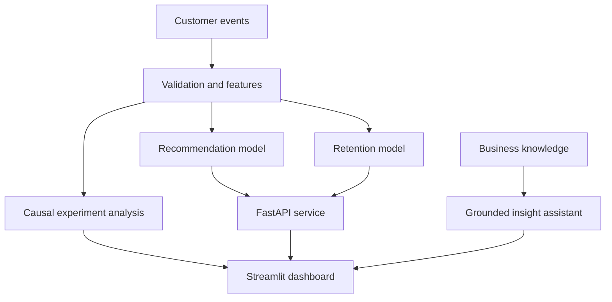

# AI Growth & Personalization Platform

An end-to-end portfolio project that turns customer interaction data into measurable growth decisions. It combines recommendation systems, churn/propensity modelling, causal campaign measurement, and a grounded AI insight assistant in one deployable application.

## Why this project matters

Product, marketing, and data teams often use separate tools to answer connected questions:

- What should we recommend to each customer?
- Which customers are at risk of leaving?
- Did a campaign cause an improvement, or was it only correlation?
- How can non-technical stakeholders understand the results quickly?

This project demonstrates how a Data Scientist can frame those questions, build reproducible models, expose results through APIs, and communicate limitations clearly.

## Architecture



## Capabilities

| Module | Method | Business use |
|---|---|---|
| Personalization | Item-to-item collaborative filtering | Rank relevant content or offers |
| Retention | Gradient boosting classification | Identify high-risk customers |
| Experimentation | Difference in means, confidence interval, bootstrap | Estimate campaign uplift |
| Segmentation | RFM-style behavioural features | Prioritize customer groups |
| AI assistant | Retrieval over approved business notes | Explain results with citations |
| Serving | FastAPI + Streamlit | Operationalize predictions and insights |
| MLOps | Tests, Docker, CI, model metadata | Reproducible delivery and monitoring readiness |

## Quick start

```bash
python -m venv .venv
source .venv/bin/activate  # Windows: .venv\Scripts\activate
pip install -r requirements.txt
python scripts/generate_data.py
streamlit run app.py
```

Run the API separately:

```bash
uvicorn api.main:app --reload
```

API documentation is available at `http://127.0.0.1:8000/docs`.

## Project structure

```text
.
├── api/main.py                 # Prediction and recommendation endpoints
├── app.py                      # Interactive business dashboard
├── data/                       # Generated demo data
├── knowledge/                  # Approved documents for grounded answers
├── scripts/generate_data.py    # Reproducible synthetic dataset
├── src/
│   ├── causal.py               # Experiment measurement
│   ├── features.py             # Customer feature engineering
│   ├── models.py               # Retention model
│   ├── rag.py                  # Lightweight grounded retrieval
│   └── recommender.py           # Collaborative filtering
├── tests/                      # Unit tests
├── Dockerfile
└── .github/workflows/ci.yml
```

## Responsible-AI design

- The demo uses synthetic data and contains no personal information.
- Predictions support prioritization; they do not make consequential decisions automatically.
- The dashboard shows model quality and uncertainty rather than presenting outputs as facts.
- The assistant answers only from approved local knowledge and returns its sources.
- Production deployment should add fairness checks, drift monitoring, access control, and human review.

## Example interview explanation

“I built an end-to-end AI growth platform that connects machine learning to measurable business outcomes. I created a reproducible event dataset, engineered customer-level features, trained a retention model, built collaborative-filtering recommendations, and estimated campaign uplift with confidence intervals. I exposed the logic through FastAPI and created a Streamlit dashboard for non-technical stakeholders. I also added a grounded retrieval assistant, tests, Docker, and CI so the project demonstrates both modelling and production engineering.”

## Roadmap

- Replace synthetic data with a public retail or media-interaction dataset.
- Add propensity-score or doubly robust causal estimation for observational campaigns.
- Track experiments and models with MLflow.
- Move feature transformations to dbt/Spark and deploy on Azure or GCP.
- Add monitoring for drift, latency, recommendation coverage, and business KPIs.

## Author

Lipsa Priyadarsinee — Data Scientist / ML & AI Engineer, Berlin

